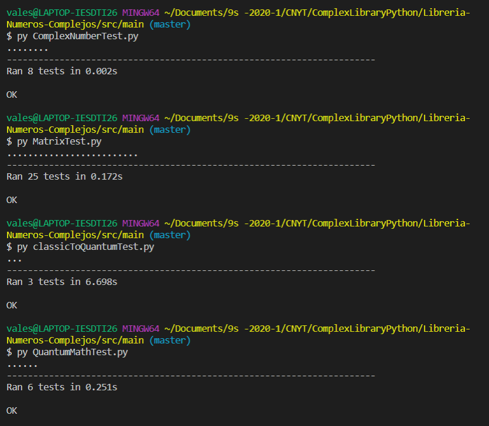

# Libreria-Numeros-Complejos

This library made in python contains the representation of complex numbers and the operations that can be performed between several complex numbers. There are also operations between complex number vectors and complex number matrices.

## Complex Numbers

A complex number consists of a real number and an imaginary number.
Represented with the expression:
 
 c = a + b x i = a + bi
 
where a is a real number, called real part of c and b is a real number, called imaginary part of c.

This library has the following operations with complex numbers
 - Addition
 - Multiplication
 - Subtract
 - Division
 - Modulus
 - Conjugate
 - Convert from cartesian coordinates to polar representation
 - Phase of a complex number

## Complex Vectors and Matrices

A Complex vector is a set of complex entries, which is similar to an ordered list of n complex numbers. 
A complex matrix is a matrix whose entries m x n are complex numbers.
A vector can be think as a special type of matrix when the n = 1, in this library the representation of vectors is as matrices of m x 1.

This library has the following operations with complex vectors/matrices

 - Addition of complex vectors.
- Inverse (additive) of a complex vector
- Multiplication of a scalar by a complex vector
- Addition of complex matrices.
- Inverse (additive) of a complex matrix.
- Multiplication of a scalar by a complex matrix.
- Transpose of a matrix/vector
- Conjugate of a matrix/vector
- Adjoint (dagger) of a matrix/vector
- Product of two matrices (of compatible sizes)
- Function to calculate the "action" of a matrix on a vector.
- Inner product of two vectors
- Norm of a vector
- Distance between two vectors
- Check if a matrix is unitary
- Check if a matrix is Hermitian
- Tensor Product of Matrix/Vector 
- Eigen Values of a Matrix

## Classical to Quantum

Representing a (weighted) graph with n vertex as an adjacency matrix. The matrix will tell the dynamic of the system ( How it change ). These weights describe the probability of our marble moving from one vertex to another in one time click.
The state (vector) of the system will tell us the probabilities of being on each vertex.
This library implements the following operations:

- Calculates the state before n "clicks" of a system giving the adjacency matrix, the initial state vector and a number n that represent the number of "clicks".
- Plots the probabilities of a state vector
- calculates the probability of a state vector

Also simulates the experiment of:

- The marble experiments with Boolean coefficient
- Classic probabilistic three-slit experiment
- Quantum multiple-slit experiment.

## Basic Quantun Theory

The basic Quantum theory associates a vector space to a quantum system. The dimension of this space reflects the amount of basic states of the system. The states can be superposed, by adding their representing vectors. The state space has  a geometry, given by its inner product, it tells us the likelihood for a given state to transition into another one after being measured. Also Observables are represented by hermitian operators. The result of an observation is an eigenvalue of the hermitian.
This library implements the following operations of quantum systems:

- Calculates the probability of finding a particle at a particular position.
- The probability of transiting from the first vector to the second.
- Calculate the variance and mean of an observable.
- A function checks if a matrix is hermitian, and if it is, it calculates the mean and the variance of the observable in the given state.
- calculates the eigenvalues of an observable and the probability that the system transitions to one of the eigenvectors after the observation.

## Getting Started

 In order to use this project, first clone this repository or download the project.

### Prerequisites

You will need python3 and  Sympy (a python library) installed on your machine to use this library

To get sympy use the following command 

```
pip install sympy
```
To get numpy use the following command 
```
pip install numpy
```
To get matplotlib use the following command 
```
pip install matplotlib
```
To execute the library you can use IDLE python

## Running the tests

In order to run the tests of this library go to the folder src and then folder main and execute the following commands.

```
py MatrixTest.py
py ComplexNumberTest.py
py classicToQuantumTest.py
py QuantumMathTest.py
```



* Quantum double-slit experiment probability plot bar in classicToQuantumTest


## Built With

* [Python](https://www.python.org/) - Programming Lenguage


## Authors

* **Valentina Siabatto** - *Escuela Colombiana de Ingeniería Julio Garavito* 

See also the list of [contributors](https://github.com/Siabell/AREP-lab1-introduccion/graphs/contributors) who participated in this project.

## License

This project is licensed under the GNU General Public License v3.0 - see the [LICENSE.md](LICENSE.md) file for details

